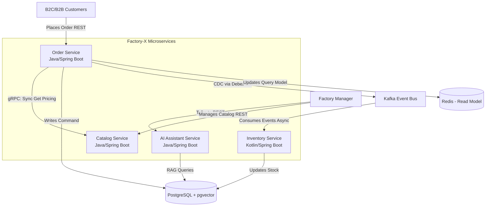

# Factory-X C4 Architecture

This document outlines the containers and communication patterns of the Factory-X microservices architecture as
described in the migration plan.

## Container Diagram

```mermaid
graph TD
%% External Actors
    B2C[B2C/B2B Customers]
    Manager[Factory Manager]
%% Infrastructure
    Kafka[Kafka Event Bus]
    Redis[(Redis - Read Model)]
    Postgres[(PostgreSQL + pgvector)]
%% Services (Containers)
    subgraph Factory-X Microservices
        Catalog[Catalog Service<br>Java/Spring Boot]
        Inventory[Inventory Service<br>Kotlin/Spring Boot]
        Order[Order Service<br>Java/Spring Boot]
        AI[AI Assistant Service<br>Java/Spring Boot]
    end

%% Relationships
    B2C -->|Places Order REST| Order
    Manager -->|Talks to REST| AI
    Manager -->|Manages Catalog REST| Catalog
    Order -->|gRPC: Sync Get Pricing| Catalog
    Order -->|Writes Command| Postgres
    Order -->|CDC via Debezium| Kafka
    Order -->|Updates Query Model| Redis
    Kafka -->|Consumes Events Async| Inventory
    Inventory -->|Updates Stock| Postgres
    AI -->|RAG Queries| Postgres
```
